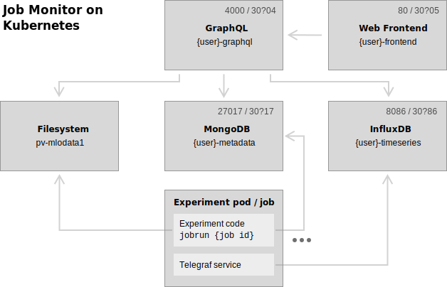

# MLO Job Monitor Scripts

The aim of this environment is to help you:

* __keep track of experiments__ in a reproducible way
* __compare results__ (metrics, graphs)
* __explain differences__ by diffing experiment configs
* __schedule jobs__ on the Kubernetes cluster

The project was initially designed by Thijs for single-person use.
Andreas now adopted the system, too, and helped to improve documentation and concentrate user-specific code.

The documentation is not so mature yet, so it will still take a few days to adopt all the moving parts of the system.

## System overview




## Docs to be added

- Installation
    * Installing the jobmonitor python package (local)
    * Creating a pod and uploading it to the EPFL Docker repository
    * Configuring & launching the permanent server pods
- Scheduling a job
    * The principle: make metadata entry and upload code
    * Scheduling functions
    * Requirements for a main script
- Logging metrics
- Monitoring job progress
- Viewing results


## Timeseries data

Much of the log information that is interesting in ML training forms a timeseries. Consider training loss over time, learning rate, norm(activations) in layer 5, ... There are amazing software stacks to track timeseries like webserver throughput and hardware utilizaiton over a large cluster, and we can use the same stack to track training timeseries. We can use:

* [InfluxDB](https://docs.influxdata.com/influxdb/v1.7/): a timeseries database
    - Format:<br>`("training_loss", {"iteration": 1, "value": 0.45}, tags={"host": "iccluster45", "user": "vogels", "experiment_id": 10})`
    - Each unique set of 'tags' forms a separate timeseries that can be queried efficiently.
    - We have one cluster node that runs the database. The other nodes send metrics there.
* [Telegraf](https://www.influxdata.com/time-series-platform/telegraf/): agent for collecting metrics and reporting them to InfluxDB.
    - Designed for high throughput.
    - Keeps a buffer on the worker node that is sent to the database periodically.
    - [Python client](https://github.com/paksu/pytelegraf):
        ```python
        # pip install pytelegraf
        from telegraf.client import TelegrafClient
        client = TelegrafClient(host='localhost', port=8092)
        client.metric('training_loss', 0.46) # fast & non-blocking
        ```
* [Grafana](https://grafana.com/): web interface to display the data in an easily customizable way


### InfluxDB Setup

The easiest way is to use the Docker image [influxdb](https://hub.docker.com/r/_/influxdb/) to run a server.

Running an instance locally:
```bash
docker run -p 8086:8086 -it influxdb
```

Deploying on the container cluster:
```bash
# (1) In pod-timeseries.yaml, replace 'vogels' by your username and 'runAsUser' by your UID
# (2) In svc-timeseries.yaml, replace 'vogels' by your username and 'runAsUser' by your UID
kubectl create -f databases/timeseries/
```

The command launces a pod that runs the database and a service that lets you connect to this database form outside the container cluster (in the EPFL network). To figure out the IP and port of the server:

```bash
kubectl get svc | grep ${USER}-svc-timeseries
# output: vogels-svc-timeseries LoadBalancer 10.233.10.205 <pending> 8086:10035/TCP 1m
#         ^ port = 10035, ip is only for inside the cluster
kubectl get pod ${USER}-pod-timeseries -o yaml | grep hostIP
# output: hostIP: 10.90.47.10
#         ^ that's the IP we need on the regular EPFL network
```

You are done if you can to the database with the `influx` client:
```bash
influx --host 10.90.47.10 --port 10035
# Connected to http://10.90.47.10:10035 version 1.7.0
# InfluxDB shell version: v1.7.0
# Enter an InfluxQL query
# >
```
(get the client with `brew install influxdb`, or something similar)

InfluxDB has an [SQL-like query syntax](https://docs.influxdata.com/influxdb/v1.7/introduction/getting-started/)


### Telegraf setup

*(already done on iccluster)*

So you have an InfluxDB database in which you want to store training logs. You can directly use the InfluxDB HTTP API to send your metrics to that database, but if you send data often, this can get slow. A better way is to use a local buffer like Telegraf.

Telegraf is most often used to collect system utilization metrics (like CPU/mem/disk/GPU). It has a large ecosystem of plugins that automatically report these metrics to a database like InfluxDB. We can use it for this purpose, but we can also use it as a local buffer to mediate the talking to the database. We use the packaged plugin `inputs.socket_listener` to send metrics to over `UDP`. To install the service:

```bash
# (1)
apt-get update && apt-get install -y telegraf
# (2) Copy ./databases/timeseries/telegraf.conf to /etc/telegraf/telegraf.conf and replace two occurences of http://{{ influxdb_host }}:{{ influxdb_port }}
# (3)
sudo service telegraf start
```

With the provided `telegraf.conf`, you will start sending system utilization information to the database `telegraf`, and any input from UDP into `training`.

Go ahead and try sending a test metric:

```python
# pip install pytelegraf
from telegraf.client import TelegrafClient
client = TelegrafClient(host='localhost', port=8092)

# Records a single value with no tags
client.metric('test_metric', 123)

# Records a three values with different data types
client.metric('test_metric', {'value_a': 100, 'value_b': 100, 'value_c': True})

# Records a single value with one tag
client.metric('test_metric', 123, tags={'server_name': 'my-server'})
```

### Grafana setup

To visualize the data you are sending to InfluxDB, you can use [Grafana](http://docs.grafana.org/installation/debian/).

You can start a local instance with:

```bash
docker run -d --name=grafana -p 3000:3000 grafana/grafana
```

or follow the [installation instructions](http://docs.grafana.org/installation/debian/) if you don't like Docker.

Go to http://localhost:3000 and try to make a graph of CPU utilization.

An alternative to Grafana is [Chronograf](https://www.influxdata.com/time-series-platform/chronograf/).
